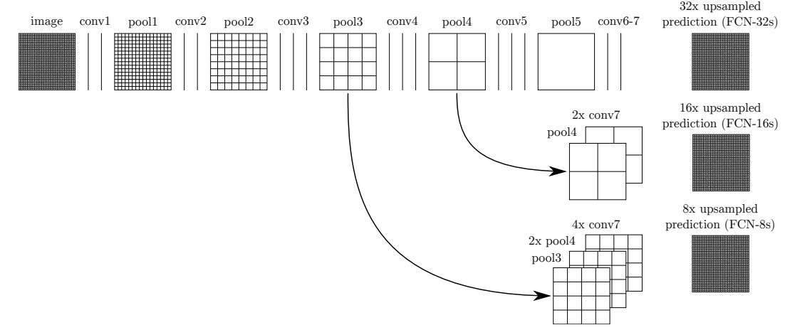
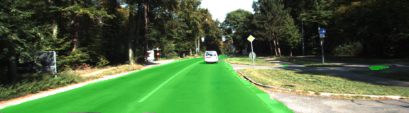

# Semantic Segmentation
### Introduction
In this project, I implemented the FCN and got the following results.

### Implementation
##### Fully Convolutional Networks

##### Parameters
Parameter |Test A                   |  Test B
:--------:|:-------------------------:|:-------------------------:
Kernel Init stddev | 0.01             |  0.01
l2_regularizer     | 0.0001           |  0.001
Learning Rate      | 0.0001           |  0.0009
Batch Size         | 2                |  5

### Result
#### Outputs
Test A's results are better than Test B.
I modified several parameters but I think l2_regularizer parameter is very important for performance of FCN.

Test A                   |  Test B
:-------------------------:|:-------------------------:
  |  
  |  
  |  

#### Cross Entropy Loss and IoU
Cross Entropy Loss is dropped and IoU is saturated after 7 epochs.

