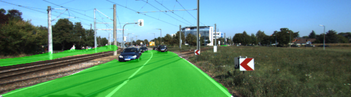
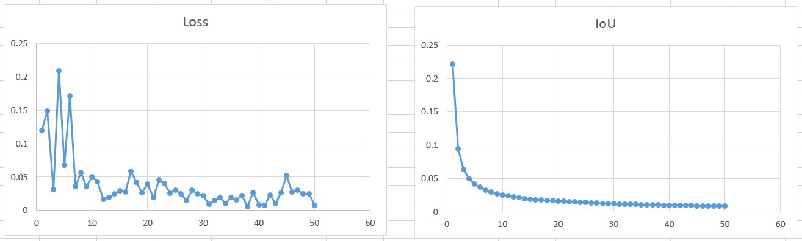

# Semantic Segmentation
### Introduction
In this project, you'll label the pixels of a road in images using a Fully Convolutional Network (FCN).

### Implementation
##### Fully Convolutional Networks

##### Parameters
Parameter |Test A                   |  Test B
:--------:|:-------------------------:|:-------------------------:
Kernel Init stddev | 0.01             |  0.01
l2_regularizer     | 0.0001           |  0.001
Learning Rate      | 0.0001           |  0.0009
Batch Size         | 2                |  5

### Result
#### Outputs
Here are results of Test A vs. Test B

Result A                   |  Result B
:-------------------------:|:-------------------------:
  |  
  |  
  |  

#### Loss and IoU

